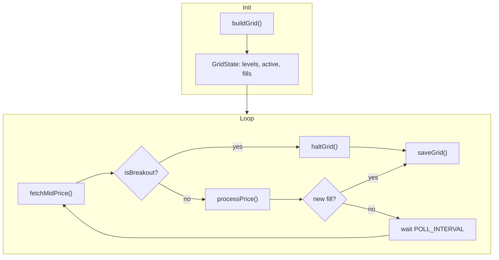
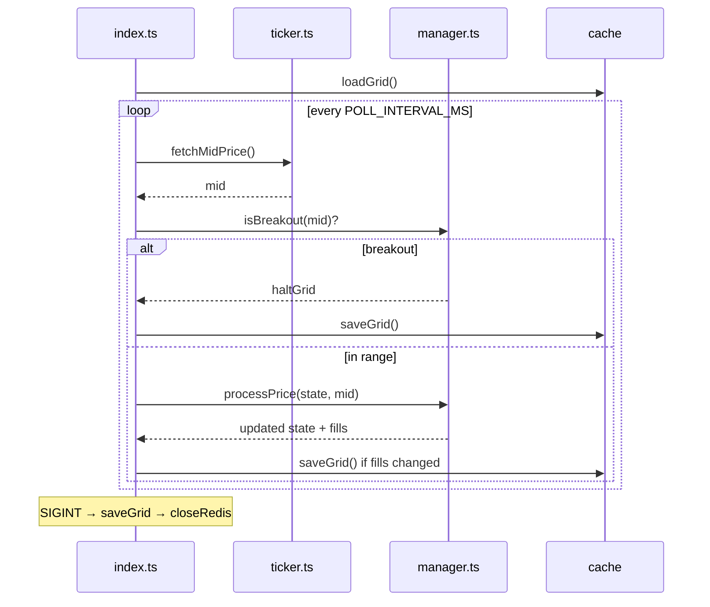

# Grid Trading Agent

> Systematic **mean-reversion grid** for sideways markets — places a ladder of buy/sell levels between `GRID_LOW` and `GRID_HIGH`, **rebalances on fills**, and **halts on breakout**.

```text
  GRID_LOW ────●────●────●────●──── GRID_HIGH
               buy  sell buy  sell
                    │
                    ▼
              Mid price poll
                    │
         Fill? → flip adjacent level
                    │
         Breakout? → halt grid
```

---

## How it works

1. **Build** `GRID_LEVELS` evenly spaced prices between `GRID_LOW` and `GRID_HIGH` (`src/grid/builder.ts`).
2. **Poll** mid price from Coinbase public book every `POLL_INTERVAL_MS`.
3. **Simulate fills** when price crosses a level (simulation mode logs `[sim] fill`).
4. **Rebalance** — after a buy fill, arm a sell one level up (and vice versa) via `processPrice`.
5. **Halt** if price exits the range by `BREAKOUT_PCT` — avoids runaway inventory in trends.
6. **Persist** full grid state to Redis on fills and shutdown.



---

## Grid mental model

```text
Price rises ↑

  Level 5  ── SELL  (armed after buy @ 4)
  Level 4  ── BUY   ✓ filled
  Level 3  ── SELL
  Level 2  ── BUY
  Level 1  ── SELL
  ───────── GRID_LOW

Each fill "flips" the neighbor level to the opposite side — classic grid recycling.
```

---

## Project structure

```text
grid-trading-agent/
├── .env.example
├── package.json
├── tsconfig.json
├── README.md
│
├── scripts/
│   └── smoke-test.ts            # Grid builder + processPrice smoke test
│
└── src/
    ├── index.ts                 # Poll loop, load/save grid, SIGINT handler
    │
    ├── config/
    │   ├── env.ts               # Range, levels, breakout %, poll interval
    │   └── logger.ts
    │
    ├── cache/
    │   ├── redis.ts             # ioredis-xyz
    │   └── store.ts             # grid-state key
    │
    ├── price/
    │   └── ticker.ts            # Public mid from order book
    │
    └── grid/
        ├── builder.ts           # buildGrid — linear level spacing
        └── manager.ts           # processPrice, isBreakout, haltGrid
```

### Module map

| Path | Responsibility |
|------|----------------|
| `src/grid/builder.ts` | Creates initial buy/sell level array from env bounds |
| `src/grid/manager.ts` | Price crossing logic, fill simulation, breakout detection |
| `src/price/ticker.ts` | `fetchMidPrice(productId)` from public API |
| `src/index.ts` | Main interval; saves state on fill + graceful shutdown |
| `src/cache/*` | Key `grid-state` (prefix `cb-grid:`) |

---

## Run

```bash
cp .env.example .env
# Set GRID_LOW / GRID_HIGH around current market (e.g. BTC 95k–105k)
npm install
npm run check
SIMULATION_MODE=true npm start
```

Tune the range to a **sideways** band — grids lose money in strong trends unless breakout halt saves you early.

---

## Configuration

| Variable | Default | Description |
|----------|---------|-------------|
| `SIMULATION_MODE` | `true` | Log fills; no limit orders |
| `PRODUCT_ID` | `BTC-USD` | Coinbase product |
| `GRID_LOW` | `90000` | Lower bound |
| `GRID_HIGH` | `110000` | Upper bound |
| `GRID_LEVELS` | `10` | Number of price rungs |
| `ORDER_SIZE` | `0.001` | Base size per level |
| `POLL_INTERVAL_MS` | `5000` | Price poll interval |
| `BREAKOUT_PCT` | `2` | Halt if price exits range by this % |

**Redis:**

```bash
REDIS_URL=redis://localhost:6379
REDIS_ENABLED=true
REDIS_KEY_PREFIX=cb-grid:
```

---

## Lifecycle diagram



---

## Going live

Wire `coinbase-api` limit placement at armed levels when `SIMULATION_MODE=false`. Start with a **narrow range** and small `ORDER_SIZE`; monitor inventory if price walks out of the grid.
